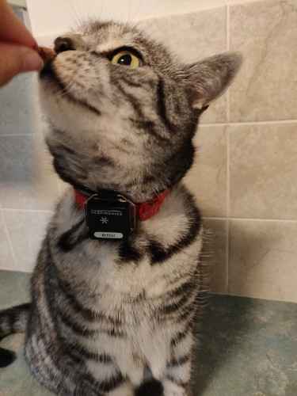

# Early disease detection classifiers for wearables on domestic cat
This repository contains the source code that accompanies our paper "Early disease detection classifiers for wearables on domestic cat" - available at xxx

<div style="text-align:center">
  
</div>

## How To Use

1) Clone the repository.
```bash
git clone https://github.com/biospi/WodCat.git
```
2) Change directory
```bash
cd WodCat/
```
3) Create python virtual environment 
```bash
python3 -m venv venv
```
4) Activate the environment
```bash
source venv/bin/activate
```
5) Install dependencies 
```bash
pip install --upgrade pip==21.3.1
make environment
```

## Dataset
Download dataset here xxx 
```bash
curl xxx
```

## Reproduce paper results
Run paper.py
```bash
python paper.py
```
